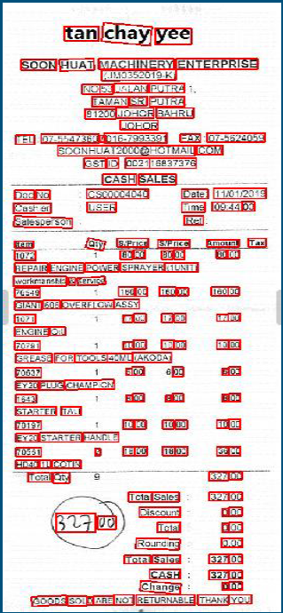

# Invoice-Processing-System  
 This repository is for the purpose of TSEC Hackacthon'21 and maintained by Team <b>LetsHackIt</b>  

<!-- PROJECT SHIELDS -->
[![Contributors][contributors-shield]][contributors-url]
[![Forks][forks-shield]][forks-url]
[![Stargazers][stars-shield]][stars-url]
[![Issues][issues-shield]][issues-url]
[![MIT License][license-shield]][license-url]

<!-- PROJECT LOGO -->
 

  

  <h3 align="center">InvoiceXvision: Invision</h3>

  

    An Invoice processing app to extract useful information from your invoice
     
     
     
    <a href="https://youtu.be/iqgeiS2IIQU">View Demo</a>
    ·
    <a href="https://github.com/SravanChittupalli/Invoice-Processing-System">Report Bug</a>
  

<!-- TABLE OF CONTENTS -->

  
Table of Contents

  <ol>
    <li>
      <a href="#about-the-project">About The Project</a>
      <ul>
        <li><a href="#built-with">Built With</a></li>
      </ul>
    </li>
    <li><a href="#screenshots">Screenshots</a></li>
    <li><a href="#contributors">Contributors</a></li>
    <li><a href="#license">License</a></li>
    <li><a href="#acknowledgements">Acknowledgements</a></li>
  </ol>

<!-- ABOUT THE PROJECT -->
## About The Project

  

One major problem in the finance world is that invoice formats are not standard and structured. Extracting useful information from these documents is easy for humans but not for machines.

Tasks performed :
* Upload invoices in PDF/scanned images  
* ML model extracts required information 
* Information is exported into JSON format

### Built With

* [Flutter](https://api.flutter.dev/)
* [Pytorch](https://pytorch.org/docs/stable/index.html)
* [Tesseract](https://github.com/tesseract-ocr/tesseract)
* [OpenCv](https://docs.opencv.org/master/d6/d00/tutorial_py_root.html)
* [Flask](https://pypi.org/project/Flask/)
* [ngrok](https://ngrok.com/)

<!-- USAGE EXAMPLES -->
## Screenshots

### App Screenshots

  
  

 
  

### DL Screenshots

 
  
 

<!-- CONTRIBUTORS -->
## Contributors
:smile:
[Sravan Chittupalli](https://github.com/SravanChittupalli):smiley:
[Shantanu Pande](https://github.com/shan515) :innocent:
[Twisha Shah](https://github.com/high-functioning-sociopath) :sunglasses:
[Prithvi Shirke](https://github.com/prithvi1809) 

<!-- LICENSE -->
## License

Distributed under the MIT License. See `LICENSE` for more information.

<!-- MARKDOWN LINKS & IMAGES -->
<!-- https://www.markdownguide.org/basic-syntax/#reference-style-links -->
[contributors-shield]: https://img.shields.io/github/contributors/SravanChittupalli/Invoice-Processing-System.svg?style=for-the-badge
[contributors-url]: https://github.com/othneildrew/Best-README-Template/graphs/contributors
[forks-shield]: https://img.shields.io/github/forks/SravanChittupalli/Invoice-Processing-System.svg?style=for-the-badge
[forks-url]: https://github.com/SravanChittupalli/Invoice-Processing-System/network/members
[stars-shield]: https://img.shields.io/github/stars/SravanChittupalli/Invoice-Processing-System.svg?style=for-the-badge
[stars-url]: https://github.com/SravanChittupalli/Invoice-Processing-System/stargazers
[issues-shield]: https://img.shields.io/github/issues/SravanChittupalli/Invoice-Processing-System.svg?style=for-the-badge
[issues-url]: https://github.com/SravanChittupalli/Invoice-Processing-System/issues
[license-shield]: https://img.shields.io/github/license/SravanChittupalli/Invoice-Processing-System.svg?style=for-the-badge
[license-url]: https://github.com/SravanChittupalli/Invoice-Processing-System/blob/master/LICENSE.txt
[linkedin-shield]: https://img.shields.io/badge/-LinkedIn-black.svg?style=for-the-badge&logo=linkedin&colorB=555
[linkedin-url]: https://linkedin.com/in/othneildrew
[product-screenshot]: images/screenshot.png

